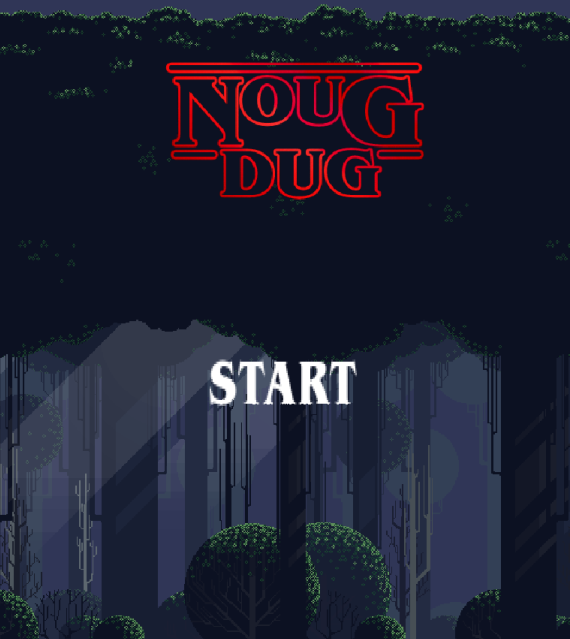
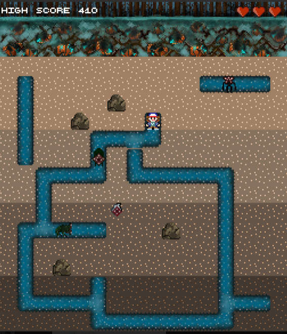

# NougDug - A game done as a school project with focus on object oriented programming.

As a player you must save humanity from the monsters that have invaded the planet. They are underground and with your favorite nougat cookie you eliminate them to collect the highest points possible.

You do this by over feeding the monsters until they burst or smash them with falling rocks. The game is inspired by the old
arcade game Dig Dug from the year 1982 and the popular Netflix series Stranger Things. You are humanity's only hope to force back the creatures of the Upside Down dimension. Can you save us?

***Sounds great! Give me more details!***  

Noug Dug is a 2-dimensional 16-bit rough fun adventurous and charming game. Where you play as Dustin, one of the
characters from Stranger Things and dig around to find the monsters.
You start in the middle of the playing field underground. Dig tunnels by walking around the playing field and watch out
for Demogorgons and Demodogs that will chase you if they spot you. If they get you, or if you get hit by a Demogorgon's slime, you lose a life. The creatures can walk through earth and rocks. Distract
the creatures by throwing out nougat cookies and walking past them.

